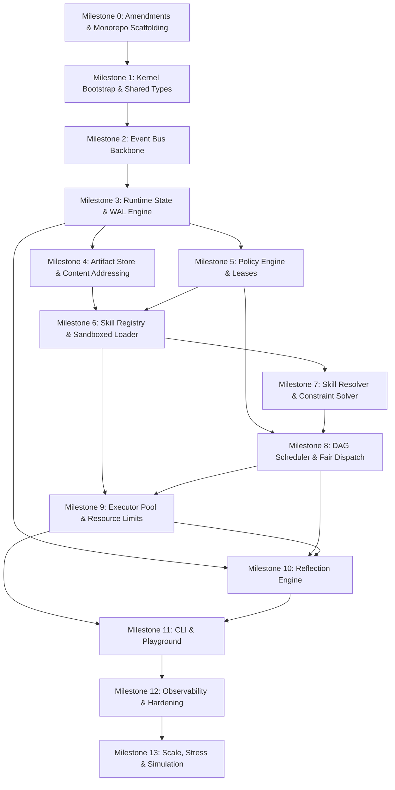

# AGY Kernel — Comprehensive Implementation Gap Analysis

**Date:** 2026-08-21  
**Status:** Post-Architecture Freeze Baseline Analysis  
**Target Specification:** AGY Kernel Implementation Plan (`# AGY Kernel Implementation Plan.txt`)  
**Repository Root:** `C:\Users\cid\Downloads\my-agy-skill-base-main\my-agy-skill-base-main`

---

## 1. Executive Summary

A comprehensive, file-by-file audit of the AGY repository against the frozen **AGY Kernel Implementation Plan** was performed. 

The current repository represents an **early-stage architecture specification and skill catalog repository**. The architecture, contracts, and skill metadata are richly documented across 14 comprehensive RFCs (RFC-0001 to RFC-0015, excluding 0009) and 30 v2 skill definitions (`skills/agy-skills-v2`). However, **zero executable kernel code exists today**; the `kernel/`, `schemas/`, and `examples/` directories contain only placeholder `README.md` files.

The architecture is **frozen** and sound. No fundamental redesign is needed. The gap between the current repository and a production-grade AGY Kernel is purely an **engineering execution and construction gap**, requiring strict, milestone-ordered delivery from bootstrap to scale hardening.

---

## 2. Current Repository State Overview

| Directory / Resource | Current Contents & State | Implementation Status |
|---|---|---|
| **Root Files** | `README.md`, `AGY_HANDOFF.md` | Complete (historical documentation & handoff guidance) |
| `docs/` | `RFC-0000-System-Overview.md`, `glossary.md`, `architecture/README.md`, `diagrams/README.md` | Partial (overview & glossary complete; architecture/diagram folders are placeholders) |
| `docs/rfcs/` | 14 detailed RFC documents (RFC-0001 through RFC-0008, RFC-0010 through RFC-0015) | Complete specifications (drafts accepted as post-freeze canon) |
| `skills/agy-skills-v2/` | 30 skill packages across `00-kernel`, `01-planning`, `03-analysis`, `05-agents`, `utilities`, with `manifest.json` and `ORCHESTRATOR.md` | Complete skill definitions & metadata catalog |
| `kernel/` | Single placeholder `README.md` (5 lines) | **0% implemented (Missing)** |
| `schemas/` | Single placeholder `README.md` (4 lines) | **0% implemented (Missing)** |
| `examples/` | Single placeholder `README.md` (4 lines) | **0% implemented (Missing)** |
| `packages/` | Directory does not exist | **Missing** |
| `apps/` | Directory does not exist | **Missing** |
| `tests/` | Directory does not exist | **Missing** |
| `benchmarks/` | Directory does not exist | **Missing** |

---

## 3. Subsystem-by-Subsystem Gap Analysis

### 3.1 Kernel Bootstrap & Composition Root (`packages/kernel`)
- **Status:** **Missing (0%)**
- **Target Interface:** `IKernel` (boot, shutdown, status, health, DI container)
- **Gaps:**
  - No composition root wiring dependencies in boot order.
  - No graceful shutdown or drain orchestration.
  - No configuration loader (`KernelConfig`).

### 3.2 Event Bus (`packages/event-bus`)
- **Status:** **Missing (0%)** (Specified in RFC-0006)
- **Target Interface:** `IEventBus`
- **Gaps:**
  - No event pub/sub engine, topic routing, or ordering key queues.
  - Missing RFC-0006a amendment (At-least-once delivery guarantee + idempotent consumers).
  - No dead-letter queue or replay mechanism.

### 3.3 Runtime State (`packages/runtime-state`)
- **Status:** **Missing (0%)** (Specified in RFC-0005)
- **Target Interface:** `IRuntimeState`
- **Gaps:**
  - No single-writer command queue implementation (`transact()`).
  - No copy-on-write snapshotting or state versioning.
  - No Write-Ahead Log (WAL) or crash recovery replay mechanism.
  - No execution ledger tracking (`ExecutionLedger`).

### 3.4 Artifact System (`packages/artifact`)
- **Status:** **Missing (0%)** (Specified in RFC-0004)
- **Target Interface:** `IArtifactStore`
- **Gaps:**
  - No content-addressed storage engine (SHA-256 hash derived).
  - No `ArtifactEnvelope` streaming I/O (`ReadableStream`).
  - No reference-counting garbage collection (`gc()`, `pin()`).

### 3.5 Policy Engine (`packages/policy`)
- **Status:** **Missing (0%)** (Specified in RFC-0003)
- **Target Interface:** `IPolicyEngine`
- **Gaps:**
  - No stateless policy evaluation pipeline.
  - Missing RFC-0003a amendment (Deterministic policy conflict resolution order: deny-overrides).
  - No `Lease` issuance and revocation tracking.

### 3.6 Skill Registry & Loader (`packages/registry`)
- **Status:** **Missing (0%)** (Specified in RFC-0002)
- **Target Interfaces:** `ISkillRegistry`, `ISkillLoader`
- **Gaps:**
  - No multi-root filesystem scanner (`project`, `user`, `global`, `plugin`).
  - No canonical manifest parser & validator against strict schema.
  - Missing RFC-0002a amendment (Skill Unload & Drain Protocol for in-flight tasks during hot reload).
  - No process/worker sandbox isolation boundary for loaded skills.
  - No quarantine manager for malformed/untrusted skills.

### 3.7 Skill Resolver (`packages/resolver`)
- **Status:** **Missing (0%)** (Specified in RFC-0001)
- **Target Interface:** `ISkillResolver`
- **Gaps:**
  - No inverted indices (`byProduces`, `byPredicateVariable`).
  - No backtracking constraint solver (for `requires`, `optional`, `exclusiveWith`, version ranges).
  - Missing RFC-0001a amendment (Deterministic Version Conflict Resolution Policy).
  - No DAG `ExecutionPlan` builder and topological cycle checker.
  - No deterministic `reresolve()` fallback chain evaluator.

### 3.8 Scheduler (`packages/scheduler`)
- **Status:** **Missing (0%)** (Specified in RFC-0007)
- **Target Interface:** `IScheduler`
- **Gaps:**
  - No DAG node-to-task dispatcher.
  - Missing RFC-0007a amendment (Fairness and anti-starvation policy).
  - No cooperative cancellation propagation (`AbortSignal` / `cancellationToken`).

### 3.9 Executor Pool (`packages/executor`)
- **Status:** **Missing (0%)** (Specified in RFC-0008)
- **Target Interface:** `IExecutor`
- **Gaps:**
  - No isolated worker pool (subprocess/worker thread).
  - No hard CPU/memory/time limit enforcement (`ExecutionLimits`).
  - No crash isolation (preventing skill crashes from killing kernel).

### 3.10 Reflection Engine (`packages/reflection`)
- **Status:** **Missing (0%)** (Specified in RFC-0011 & Plan Phase 3)
- **Target Interface:** `IReflectionEngine`
- **Gaps:**
  - No read-only introspection interface over state snapshots and event streams.

### 3.11 Tooling & Apps (`apps/cli`, `apps/playground`)
- **Status:** **Missing (0%)**
- **Gaps:**
  - No operator CLI (`agy run`, `agy skill install`, `agy status`).
  - No developer interactive playground.

### 3.12 Test Infrastructure & Testkit (`packages/testkit`, `tests/`)
- **Status:** **Missing (0%)**
- **Gaps:**
  - No shared testkit, mock harnesses, or test fixtures.
  - Missing all 10 test layers (Unit, Integration, Property, Concurrency, Fuzz, Benchmarks, E2E, Golden, Simulation, Stress).

---

## 4. Architectural Violations & Structural Risks

1. **Repository Layout Divergence:**
   - *Current:* Flat directory structure (`kernel/`, `schemas/`, `skills/`, `docs/`, `examples/`).
   - *Plan Target:* Clean monorepo (`packages/*`, `apps/*`, `tests/*`, `benchmarks/*`, `docs/*`, `examples/*`, `scripts/*`).
2. **Missing Boundary Enforcement:**
   - Current codebase lacks package boundary rules (every package must expose a single `index.ts` public interface file; cross-package internal imports must be forbidden by tooling/linting).
3. **Missing Canonical Machine-Readable Schemas:**
   - Schemas in `schemas/` are unwritten, while `skills/agy-skills-v2/manifest.json` and RFC definitions must be reconciled into strict JSON Schemas / TypeScript types.
4. **Historical Ordering Inversion in `AGY_HANDOFF.md`:**
   - `AGY_HANDOFF.md` historically suggested building the registry/resolver before the event bus or state engine. The frozen implementation plan correctly resolves the dependency graph and establishes that the **Event Bus and Runtime State must precede Registry and Resolver**.

---

## 5. Summary of Component Status

| Category | Component / Area | Status | Notes |
|---|---|---|---|
| **Completed** | RFC Architecture Suite (0001–0015) | ✅ Complete | Canonically frozen design base |
| **Completed** | Skill Catalog (`agy-skills-v2`) | ✅ Complete | 30 skills + manifest metadata ready |
| **Completed** | System Overview & Glossary | ✅ Complete | System documentation in place |
| **Partially Implemented** | Contract Schemas | ⚠️ Partial | Defined in prose/JSON; missing formal JSON Schemas |
| **Partially Implemented** | Architecture Docs & Diagrams | ⚠️ Partial | Folder present, diagrams not rendered |
| **Missing** | 5 Amendment RFCs (0001a, 0002a, 0003a, 0006a, 0007a) | ❌ Missing | Required before implementing respective milestones |
| **Missing** | Monorepo Structure (`packages/`, `apps/`, `tests/`) | ❌ Missing | Needs scaffolding per Phase 2 |
| **Missing** | Shared Types & DI Testkit (`packages/shared`, `testkit`) | ❌ Missing | Foundation for all kernel packages |
| **Missing** | All 9 Core Subsystems (`kernel`, `event-bus`, `runtime-state`, `artifact`, `policy`, `registry`, `resolver`, `scheduler`, `executor`) | ❌ Missing | 0% implemented |
| **Missing** | Reflection Engine (`packages/reflection`) | ❌ Missing | Read-only introspection engine |
| **Missing** | CLI & Playground Apps (`apps/cli`, `apps/playground`) | ❌ Missing | User/operator entry points |
| **Missing** | Complete Test Suite & Benchmark Harness | ❌ Missing | 10 test layers required by Phase 8 |

---

## 6. Ordered Implementation Backlog

The backlog adheres strictly to the 13-Milestone sequence defined in Phase 10 of the Implementation Plan:

### Milestone 0: Pre-Implementation Specification & Monorepo Scaffolding
- **Tasks:**
  1. Draft and merge the 5 required amendment RFCs in `docs/rfcs/`:
     - `RFC-0001a`: Version Conflict Resolution Policy (Deterministic diamond dependency rule)
     - `RFC-0002a`: Skill Unload & Drain Protocol (In-flight execution drain before disposal)
     - `RFC-0003a`: Policy Conflict Resolution Order (Deny-overrides precedence)
     - `RFC-0006a`: Event Bus Delivery Guarantee (At-least-once delivery + idempotent consumers)
     - `RFC-0007a`: Scheduler Fairness & Anti-Starvation Policy
  2. Restructure repository into the Phase 2 Monorepo format (`packages/*`, `apps/*`, `tests/*`, `benchmarks/*`, `scripts/*`).
  3. Codify canonical JSON Schemas and TypeScript interfaces in `schemas/` and `packages/shared`.

### Milestone 1: Kernel Bootstrap & Composition Root
- **Dependencies:** Milestone 0
- **Package:** `packages/kernel`, `packages/shared`
- **Deliverables:** `IKernel`, lifecycle state machine (`boot` -> `ready` -> `draining` -> `shutdown`), DI container, unified error hierarchy (`AgyError`).

### Milestone 2: Event Bus Backbone
- **Dependencies:** Milestone 1
- **Package:** `packages/event-bus`
- **Deliverables:** `IEventBus`, topic registration, per-key ordering queues, at-least-once delivery, dead-letter queue, idempotent handler contracts.

### Milestone 3: Runtime State & Transaction Engine
- **Dependencies:** Milestone 2
- **Package:** `packages/runtime-state`
- **Deliverables:** `IRuntimeState`, single-writer command queue (`transact()`), monotonic versioning, copy-on-write snapshots, append-only `ExecutionLedger`, WAL persistence and replay recovery.

### Milestone 4: Content-Addressed Artifact Store
- **Dependencies:** Milestone 2, Milestone 3
- **Package:** `packages/artifact`
- **Deliverables:** `IArtifactStore`, SHA-256 derived content addressing, `ArtifactEnvelope`, streaming I/O (`ReadableStream`), reference-counted GC (`pin()`, `gc()`).

### Milestone 5: Policy & Permission Engine
- **Dependencies:** Milestone 3
- **Package:** `packages/policy`
- **Deliverables:** `IPolicyEngine`, deny-overrides evaluation (RFC-0003a), `Lease` issuance and revocation tracking, capability validation.

### Milestone 6: Skill Registry, Discovery & Loader
- **Dependencies:** Milestone 3, Milestone 4, Milestone 5
- **Package:** `packages/registry`
- **Deliverables:** `ISkillRegistry`, `ISkillLoader`, multi-root scan (`project`, `user`, `global`, `plugin`), manifest parser & validator, capability index, quarantine manager, lifecycle drain protocol (RFC-0002a), hot reload.

### Milestone 7: Skill Resolver & Constraint Solver
- **Dependencies:** Milestone 6
- **Package:** `packages/resolver`
- **Deliverables:** `ISkillResolver`, Matcher (`byProduces`, `byPredicateVariable`), Ranker, Backtracking Constraint Solver (`requires`, `exclusiveWith`, version constraints via RFC-0001a), DAG `ExecutionPlan` builder, `reresolve()` fallback chain.

### Milestone 8: DAG Scheduler & Fair Dispatcher
- **Dependencies:** Milestone 5, Milestone 7
- **Package:** `packages/scheduler`
- **Deliverables:** `IScheduler`, DAG execution ordering, anti-starvation & weighted fairness algorithm (RFC-0007a), bounded task dispatch queue, cooperative cancellation tokens.

### Milestone 9: Sandboxed Executor Pool
- **Dependencies:** Milestone 6, Milestone 8
- **Package:** `packages/executor`
- **Deliverables:** `IExecutor`, sandboxed worker pool (process/worker isolation), hard resource limits (`ExecutionLimits`), crash isolation, cancellation propagation.

### Milestone 10: Reflection Engine & Introspection
- **Dependencies:** Milestone 3, Milestone 8, Milestone 9
- **Package:** `packages/reflection`
- **Deliverables:** `IReflectionEngine`, read-only state/event introspection, diagnostics aggregator for operator visibility.

### Milestone 11: Operator CLI & Playground
- **Dependencies:** Milestones 1–10
- **Package:** `apps/cli`, `apps/playground`
- **Deliverables:** CLI commands (`agy run`, `agy skill install`, `agy status`), interactive developer sandbox.

### Milestone 12: Observability, Telemetry & Hardening
- **Dependencies:** Milestones 1–11
- **Package:** Cross-cutting across all packages
- **Deliverables:** Structured JSON logging, Prometheus metrics, distributed trace spans (`causationId`/`taskId`), health endpoints (`/health`), crash reporting.

### Milestone 13: Scale, Stress & Simulation Verification
- **Dependencies:** Milestones 1–12
- **Package:** `tests/simulation`, `benchmarks/`
- **Deliverables:** 10k skill graph resolution benchmarks, long-running multi-skill autonomous workflow simulations, chaos failure recovery tests.

---

## 7. Next Action Recommendation

1. Review and approve this Gap Analysis report.
2. Formalize and merge the **5 Amendment RFCs** (`RFC-0001a`, `RFC-0002a`, `RFC-0003a`, `RFC-0006a`, `RFC-0007a`) in `docs/rfcs/`.
3. Scaffold the **Monorepo Directory Structure** (`packages/`, `apps/`, `tests/`, `benchmarks/`, `scripts/`) per Phase 2.
4. Begin execution of **Milestone 1 (Kernel Bootstrap)**.
