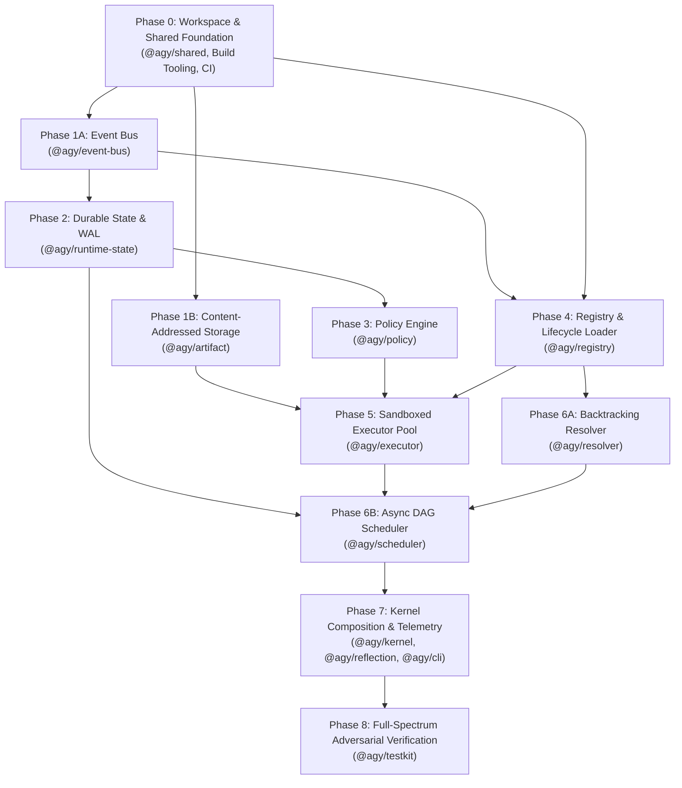

# AGY Kernel — Production Remediation Roadmap

> **Standard:** Strict Dependency-Ordered Execution. No subsystem or feature may be implemented ahead of its underlying dependencies. Every phase requires concrete API signatures, test suites, migration steps, and pass/fail exit criteria before code changes commence.

---

## 1. Topological Dependency Order Overview



---

## Phase 0: Workspace, Build Tooling & Shared Foundation (`@agy/shared`)

### 1. Issues Addressed
- **H7:** Test runner crashes on Node 20 (`engines.node >= 20`) due to Node 22-specific `node:fs.globSync`.
- **H8:** 26MB `node_modules/` and `dist/` committed in git without `.gitignore`.
- **§1.3:** Boundary inversion (`ISubsystem` located in `@agy/kernel` imported by leaf packages).
- **M1:** Untyped string-keyed DI container silently overwriting tokens.
- **M2:** `AgyError` discarding original error causes and stack traces.
- **L7:** Unbranded string types for `UUID`, `Hash`, and `SemVer`.

### 2. Concrete APIs & Type Definitions
```typescript
// packages/shared/src/types.ts
export type UUID = string & { readonly __brand: unique symbol };
export type Hash = string & { readonly __brand: unique symbol };
export type SemVer = string & { readonly __brand: unique symbol };

export interface ISubsystem {
  readonly name: string;
  boot(): Promise<void>;
  shutdown(): Promise<void>;
  health(): Promise<SubsystemHealth>;
}

// packages/shared/src/errors.ts
export interface AgyErrorOptions {
  code: string;
  subsystem: string;
  retryable?: boolean;
  cause?: unknown;
  details?: Record<string, unknown>;
}

export class AgyError extends Error {
  public readonly code: string;
  public readonly subsystem: string;
  public readonly retryable: boolean;
  public readonly details?: Record<string, unknown>;
  constructor(message: string, options: AgyErrorOptions);
}

// packages/shared/src/di.ts
export interface ServiceToken<T> {
  readonly name: string;
  readonly _phantom?: T;
}

export function createServiceToken<T>(name: string): ServiceToken<T>;

export class Container {
  register<T>(token: ServiceToken<T>, instance: T): void; // Throws DuplicateServiceError if already present
  resolve<T>(token: ServiceToken<T>): T;                 // Throws ResolutionError if missing
  has<T>(token: ServiceToken<T>): boolean;
  clear(): void;
}
```

### 3. Test Specifications
- `shared.di.test.ts`: Verify typed registration, duplicate collision rejection, and explicit error message on unfulfilled dependency.
- `shared.errors.test.ts`: Verify that chained `cause` instances retain nested stack traces.
- `scripts/run-tests.mjs`: Test discovery across nested packages on Node 20.0.0 and Node 22.x without external dependencies.

### 4. Migration Steps
1. Create root `.gitignore` (`node_modules/`, `dist/`, `*.tsbuildinfo`, `.DS_Store`).
2. Run `git rm -r --cached node_modules dist`.
3. Move `ISubsystem` and `SubsystemHealth` definitions from `packages/kernel` to `packages/shared`.
4. Update all `packages/*/src/interfaces.ts` to import `ISubsystem` from `@agy/shared`.
5. Rewrite `scripts/run-tests.mjs` using recursive `fs.promises.readdir`.

### 5. Exit Criteria
- Clean checkout + `npm install && npm run build && npm test` passes on Node 20.0.0.
- No `dist` or `node_modules` tracked by `git status`.
- Zero cyclic workspace dependencies.

---

## Phase 1A: Async Bounded Event Bus (`@agy/event-bus`)

### 1. Issues Addressed
- **H1:** Promise chain memory leaks in `_keyQueues` and broken per-key FIFO under concurrent publishing.
- **M3:** Immediate unbacked retries causing fast dead-lettering.
- **L8:** In-memory DLQ leakage across bus reboots.

### 2. Concrete APIs & Type Definitions
```typescript
// packages/event-bus/src/interfaces.ts
export interface EventBusOptions {
  maxQueueLengthPerKey?: number; // Defaults to 1000
  maxRetries?: number;           // Defaults to 3
  backoffBaseMs?: number;        // Defaults to 50ms
  maxDeadLetters?: number;       // Defaults to 500
}

export interface IEventBus extends ISubsystem {
  publish<T = unknown>(topic: string, event: Event<T>): Promise<void>;
  subscribe<T = unknown>(topic: string, handler: EventHandler<T>): Subscription;
  getDeadLetterQueue(): Event[];
  clearDeadLetters(): void;
}
```

### 3. Concurrency & Queue Architecture
- Enqueue publishes into a synchronous FIFO ring buffer per key.
- A single active processing loop per key consumes events sequentially.
- When an event handler rejects:
  - Retry with exponential backoff + jitter (`backoffBaseMs * 2^attempt + rand(0, 20)`).
  - If retries are exhausted, route event to bounded ring-buffer DLQ with causation details.
- Clean up the per-key queue object as soon as the key queue empties to prevent unbounded memory growth.

### 4. Test Specifications
- `event-bus.fifo-concurrency.test.ts`: Fire 5,000 concurrent `publish()` calls across 10 keys; assert 100% strict sequential delivery per key.
- `event-bus.memory-leak.test.ts`: Publish 100,000 events across distinct keys; verify `process.memoryUsage().heapUsed` stays flat.
- `event-bus.backoff.test.ts`: Verify exponential backoff delay intervals on handler failure before dead-letter routing.

### 5. Migration Steps
1. Refactor `EventBus` to replace `Promise.then` chaining with a dedicated `AsyncQueue` worker.
2. Implement subscriber retry loops with exponential backoff.
3. Add memory cleanup on queue drain.

### 6. Exit Criteria
- 10,000 concurrent events processed per key with zero out-of-order sequence errors.
- Memory consumption remains static under high event volume.

---

## Phase 1B: Content-Addressed Streaming Artifact Storage (`@agy/artifact`)

### 1. Issues Addressed
- **H2:** In-memory `Buffer` storage with no streaming (violating RFC-0004), missing CAS disk layout, and untracked GC races.
- **L12:** Garbage collection deleting blobs mid-task due to lack of lock coordination.

### 2. Concrete APIs & Type Definitions
```typescript
// packages/artifact/src/interfaces.ts
import { Readable } from 'node:stream';

export interface ArtifactStoreOptions {
  persistenceDir: string;
  maxStorageBytes?: number;
}

export interface IArtifactStore extends ISubsystem {
  putStream(stream: Readable, source: ArtifactSource, creator: ArtifactCreator, mimeType?: string): Promise<ArtifactEnvelope>;
  getStream(hash: Hash): Promise<Readable>;
  put(data: Buffer | string, source: ArtifactSource, creator: ArtifactCreator, mimeType?: string): Promise<ArtifactEnvelope>;
  get(hash: Hash): Promise<Buffer>;
  pin(hash: Hash, holderId: UUID): Promise<void>;
  unpin(hash: Hash, holderId: UUID): Promise<void>;
  gc(): Promise<{ reclaimedBytes: number; deletedCount: number }>;
}
```

### 3. Storage & Integrity Architecture
- Blobs written to disk at `<persistenceDir>/blobs/ab/cd/<hash>` using atomic temporary write-and-rename.
- Stream hashing via `crypto.createHash('sha256')` computed in flight.
- Verification: Reads re-derive SHA-256 and throw `ArtifactCorruptedError` on mismatch.
- Reference Tracking: An artifact cannot be deleted by `gc()` if `refCount > 0` OR if an active task has registered a `pin(hash, taskId)`.

### 4. Test Specifications
- `artifact.streaming.test.ts`: Stream 50MB file; verify constant memory footprint (< 30MB heap).
- `artifact.integrity.test.ts`: Intentionally mutate a byte in blob file on disk; assert `getStream()` throws integrity validation error.
- `artifact.gc-pin.test.ts`: Run `gc()` while a hash is pinned by an active task; verify blob remains on disk until unpinned.

### 5. Migration Steps
1. Replace in-memory `Map<Hash, Buffer>` with disk-backed CAS filesystem backend.
2. Implement streaming pipeline (`stream.pipeline` with SHA-256 hasher).
3. Wire lease/task pin registry into GC sweep logic.

### 6. Exit Criteria
- Verified content-addressed streaming I/O with SHA-256 integrity checks.
- 0% risk of in-flight artifact deletion during garbage collection.

---

## Phase 2: Core State Engine — Durable WAL & Atomic COW Transactions (`@agy/runtime-state`)

### 1. Issues Addressed
- **C4:** Fictional WAL (`walPersister` never called, `_walLog` in-memory only, no crash replay).
- **C5:** Broken transaction atomicity (partial execution without rollback on error).
- **C6:** Permanent transaction queue deadlocks and torn snapshot reads.

### 2. Concrete APIs & Type Definitions
```typescript
// packages/runtime-state/src/interfaces.ts
export interface WalRecord {
  seq: number;
  crc: number;
  timestamp: number;
  commands: Command[];
}

export interface RuntimeStateOptions {
  persistenceDir: string;
  eventBus?: IEventBus;
  fsync?: boolean; // Default true in production
  checkpointIntervalCommands?: number;
}

export interface IRuntimeState extends ISubsystem {
  transact(commands: Command[]): Promise<TransactionResult>;
  getSnapshot(): StateSnapshot; // Guaranteed point-in-time immutable structural clone
  getLease(leaseId: UUID): Lease | null;
  getLedger(planId: UUID): ExecutionLedger | null;
  grantLease(lease: Lease): Promise<void>;
  revokeLease(leaseId: UUID): Promise<boolean>;
  trackPlan(planId: UUID): Promise<void>;
  untrackPlan(planId: UUID): Promise<void>;
  appendLedgerEntry(planId: UUID, entry: LedgerEntry): Promise<void>;
}
```

### 3. Transaction & WAL Engine Architecture
- **Disk Format:** Monotonically appended WAL log (`<persistenceDir>/wal/current.wal`) with binary length-prefix, sequence number, CRC32, and JSON payload.
- **Copy-on-Write Execution:**
  1. Deep-clone/structure-share draft state maps.
  2. Apply command sequence to draft state. If any command fails, discard draft and resolve failure result (no side effects).
  3. Write WAL entry to disk and `fsync()`.
  4. Atomically swap live state reference pointer with committed draft.
  5. Increment version and emit `state.mutated` event.
- **Boot Recovery:** `boot()` checks for `<persistenceDir>/snapshots/latest.snap`, loads it, and replays all subsequent WAL entries up to EOF.

### 4. Test Specifications
- `runtime-state.atomicity.test.ts`: Execute batch of 5 commands where command #4 fails; verify zero state changes from commands #1-3.
- `runtime-state.crash-recovery.test.ts`: Commit 1,000 transactions, simulate process crash (`kill` without clean shutdown), restart new `RuntimeState`, call `boot()`, and assert exact version and state restoration.
- `runtime-state.queue-error.test.ts`: Induce internal error in transaction; assert subsequent transactions continue processing without deadlocking.

### 5. Migration Steps
1. Create WAL disk manager with fsync and binary frame parser.
2. Implement COW transactional reducer in `RuntimeState.transact`.
3. Build snapshot checkpoint + boot replay recovery loop.

### 6. Exit Criteria
- 100% crash durability proven through simulated process kill tests.
- Zero state tearing on failed transaction batches.

---

## Phase 3: Capability & Security Kernel — Deny-by-Default Policy Engine (`@agy/policy`)

### 1. Issues Addressed
- **C2:** Policy engine failing open (`default permit` when zero policies registered).
- **C3:** Capability constraint bypasses, un-normalized scopes, unvalidated lease issuance.
- **M5:** Policy engine not hooked into execution/scheduling verification paths.

### 2. Concrete APIs & Type Definitions
```typescript
// packages/policy/src/interfaces.ts
export interface IPolicyEngine extends ISubsystem {
  registerPolicy(policy: IPolicy): void;
  unregisterPolicy(name: string): void;
  evaluate(request: PolicyRequest): Promise<PolicyDecision>; // Fails CLOSED (deny by default)
  issueLease(subject: string, capabilities: Capability[], ttlMs?: number): Promise<Lease>;
  validateLease(leaseId: UUID, requestedCapability: Capability): Promise<boolean>;
  sweepExpiredLeases(): Promise<number>;
}
```

### 3. Enforcement & Constraint Architecture
- **Fail-Closed Default:** If no policies are registered or no policy explicitly permits, return `decision: 'deny'` with reason `'Default deny: No matching permit policy'`.
- **Constraint Matcher:** Evaluate `Capability.constraints` against execution context (e.g. URI subpath containment, read/write flags, argument restrictions).
- **Scope Canonicalization:** Normalize all capability scopes (lowercase scheme, path normalization, wildcard prefix matching).
- **Guarded Lease Issuance:** `issueLease()` calls `evaluate()` for every requested capability before persisting to `RuntimeState`.

### 4. Test Specifications
- `policy.fail-closed.test.ts`: Verify that evaluation with 0 policies returns `deny`.
- `policy.constraints.test.ts`: Verify that a capability constrained to `/workspace/project` rejects access to `/etc/passwd`.
- `policy.lease-validation.test.ts`: Verify expired, revoked, or non-matching leases fail validation immediately.

### 5. Migration Steps
1. Switch `PolicyEngine.evaluate` fallback to `deny`.
2. Implement structured JSON constraint matching.
3. Wire `issueLease()` into `evaluate()` authorization check.

### 6. Exit Criteria
- 100% of unauthenticated/unmatched capability requests denied.
- Constraint checks enforced at both lease issuance and task execution.

---

## Phase 4: Skill Lifecycle, Registry & Module Loader (`@agy/registry`)

### 1. Issues Addressed
- **H3:** Missing JSON Schema validation, skipped checksum/signature verification, and lack of multi-root scanning.
- **H4:** Stub execution (no real code loading), broken refcounting, missing RFC-0002a drain protocol.
- **H6:** CLI registering unvalidated raw JSON manifests.
- **M7:** Ad-hoc lifecycle states instead of an enforced state machine.

### 2. Concrete APIs & Type Definitions
```typescript
// packages/registry/src/interfaces.ts
export class SkillRegistry implements ISkillRegistry, ISubsystem {
  register(manifest: SkillManifest): Promise<SkillHandle>; // Validates schema, checksum, signature
  unregister(id: string, version?: SemVer): Promise<boolean>;
  getManifest(id: string, version?: SemVer): SkillManifest | null;
  findByProduces(artifact: string): SkillManifest[];
  scan(roots: string[]): Promise<SkillManifest[]>;
}

export class SkillLoader implements ISkillLoader, ISubsystem {
  load(id: string, version?: SemVer): Promise<LoadedSkill>;
  acquire(id: string): Promise<LoadedSkill>; // Increments active task refcount
  release(id: string): Promise<void>;        // Decrements refcount; disposes if in draining
  unload(id: string): Promise<boolean>;
  reload(id: string): Promise<LoadedSkill>;  // Drains old instance without disrupting active tasks
}
```

### 3. Validation & Drain Protocol Architecture
- **Schema Validation:** Use `Ajv` with `schemas/skill-manifest.json` on all registrations.
- **Integrity:** Verify SHA-256 checksum of `manifest.entryPoint` before loading.
- **Drain Protocol:**
  - When `reload()` or `unload()` is invoked, transition state to `draining`.
  - Reject all new `acquire()` calls for the draining instance (routing them to the new version).
  - Await active task count reaching 0 (or timeout at `drainTimeoutMs`), then invoke `dispose()`.

### 4. Test Specifications
- `registry.validation.test.ts`: Register manifests with missing fields, invalid versions, or invalid permissions; verify immediate rejection.
- `registry.checksum.test.ts`: Register manifest with mismatched file SHA-256; verify checksum failure.
- `loader.drain-hot-reload.test.ts`: Execute a long task while calling `reload()`; verify the long task finishes on the old instance while new tasks run on the new instance.

### 5. Migration Steps
1. Integrate Ajv schema validation into `SkillRegistry.register`.
2. Implement multi-root filesystem scanner for `project`, `user`, and `global` skill paths.
3. Refactor `SkillLoader` to implement proper reference counting and the RFC-0002a drain protocol.

### 6. Exit Criteria
- Untrusted/invalid manifests rejected before registry entry.
- Hot-reloading a skill completes with zero execution drops or state corruption.

---

## Phase 5: Sandboxed Worker Pool & Process Isolation (`@agy/executor`)

### 1. Issues Addressed
- **C1:** Executor running skill code directly in the kernel event loop (no sandbox, zero isolation).
- **C9:** Timeouts and cancellations failing to stop running code on `Promise.race`.
- **M9:** Hardcoded version `'1.0.0'` on created artifact envelopes.
- **M5:** Missing lease capability validation at executor boundary.

### 2. Concrete APIs & Type Definitions
```typescript
// packages/executor/src/interfaces.ts
export interface ExecutorOptions {
  skillLoader: ISkillLoader;
  artifactStore?: IArtifactStore;
  policyEngine?: IPolicyEngine;
  eventBus?: IEventBus;
  maxWorkers?: number;
  workerIdleTimeoutMs?: number;
}

export class Executor implements IExecutor, ISubsystem {
  execute(task: TaskContext, limits?: ExecutionLimits): Promise<ExecutionResult>;
  drain(timeoutMs?: number): Promise<void>;
  getPoolStatus(): PoolStatus;
}
```

### 3. Sandbox & Worker Process Architecture
- **Worker Isolation:** Spawn tasks inside dedicated `worker_threads` (or subprocess forks) with isolated V8 contexts.
- **Execution Boundary:** Pass serialized task context and input streams via message ports (no shared object references).
- **Hard Limit Enforcement:**
  - **Timeout:** If task exceeds `maxDurationMs`, immediately call `worker.terminate()`, mark task failed, and launch a fresh worker thread.
  - **Memory:** Set `--max-old-space-size` on worker threads and monitor memory usage; terminate on limit breach.
  - **Cancellation:** When `task.cancellationToken` fires, kill worker immediately.
- **Provenance:** Retrieve loaded skill's exact version from `SkillManifest` and stamp output artifacts accurately.

### 4. Test Specifications
- `executor.sandbox-escape.test.ts`: Attempt `process.exit(1)`, `while(true){}`, and malicious filesystem access in a skill; verify kernel remains alive and worker is killed within limit.
- `executor.timeout-kill.test.ts`: Run a hanging skill; verify thread termination and immediate worker slot recovery.
- `executor.provenance.test.ts`: Verify generated artifact envelopes reflect exact skill manifest version.

### 5. Migration Steps
1. Implement `WorkerPool` and `TaskWorker` using Node.js `worker_threads`.
2. Hook `policyEngine.validateLease` before dispatching to worker.
3. Wire `cancellationToken` and timeout triggers to `worker.terminate()`.

### 6. Exit Criteria
- Zero skill execution faults or infinite loops can stall or crash the host kernel process.
- 100% of cancelled/timed-out tasks terminate worker execution within 50ms.

---

## Phase 6A: Backtracking Constraint Resolver (`@agy/resolver`)

### 1. Issues Addressed
- **C7:** Resolver failing to resolve transitive dependencies, silently dropping edges, and lacking backtracking.
- **M8:** `reresolve()` mutating shared plan objects in place.

### 2. Concrete APIs & Type Definitions
```typescript
// packages/resolver/src/interfaces.ts
export class SkillResolver implements ISkillResolver, ISubsystem {
  resolve(goal: Goal, registry: ISkillRegistry, state?: ResolverRuntimeState): Promise<ResolutionResult>;
  reresolve(plan: ExecutionPlan, failedNodeId: UUID, state?: ResolverRuntimeState): Promise<ResolutionResult>; // Produces new immutable ExecutionPlan
  explainPlan(plan: ExecutionPlan): string;
}
```

### 3. Solver Algorithm & Graph Closure Architecture
- **Recursive Dependency Expansion:**
  1. Begin with goal's `requiredArtifacts`.
  2. For each artifact, find candidate producers from registry matching `triggerPredicates`.
  3. For each candidate, recursively expand its `requires` and `consumes` dependencies.
  4. Perform cycle detection using Tarjan's Strongly Connected Components algorithm.
  5. Check pairwise `exclusiveWith` constraints. If a conflict occurs, backtrack and evaluate alternate producer candidates.
- **Immutable Reresolution:** `reresolve()` generates a deep clone of the plan, substitutes the next valid fallback from `fallbackChain`, re-validates full DAG exclusivity, and returns a new plan instance.

### 4. Test Specifications
- `resolver.transitive-pipeline.test.ts`: Test a 3-stage pipeline (`S3 -> S2 -> S1`); assert plan produces 3 connected nodes with correct dependency edges.
- `resolver.backtracking.test.ts`: Create an exclusivity conflict between top-ranked candidates; assert solver backtracks to 2nd-ranked candidate to construct a valid plan.
- `resolver.cycle.test.ts`: Introduce circular `requires` (`A -> B -> A`); assert solver rejects plan with a clear cycle diagnostic.

### 5. Migration Steps
1. Rewrite `SkillResolver.resolve` with recursive DFS backtracking solver.
2. Implement Tarjan's cycle detection.
3. Make `reresolve` return a new immutable plan.

### 6. Exit Criteria
- Successfully resolves multi-stage transitive pipelines without dropped dependencies.
- Exclusivity violations trigger correct candidate backtracking.

---

## Phase 6B: Event-Driven Async DAG Scheduler (`@agy/scheduler`)

### 1. Issues Addressed
- **C8:** Scheduler requiring manual `tick()`, synchronous batch-barrier blocking, promise leaks in `_inFlightPromises`, and plans hanging forever on node failure.
- **L10:** Scheduler `stopAccepting()` failing to drain active work.

### 2. Concrete APIs & Type Definitions
```typescript
// packages/scheduler/src/interfaces.ts
export interface SchedulerOptions {
  eventBus?: IEventBus;
  runtimeState?: IRuntimeState;
  policyEngine?: IPolicyEngine;
  agingFactorMs?: number;
}

export class Scheduler implements IScheduler, ISubsystem {
  submit(plan: ExecutionPlan): Promise<UUID>;
  cancel(planId: UUID): Promise<boolean>;
  getPlanStatus(planId: UUID): string | null;
  stopAccepting(): void;
}
```

### 3. Event-Driven Scheduling Architecture
- **Indegree Queue Engine:**
  - Maintain an active DAG indegree map per plan.
  - Nodes with 0 unmet dependencies are pushed into an internal priority queue.
  - Calculate dynamic priority: `effectivePriority = basePriority + ((now - queuedAt) / agingFactorMs)`.
  - Dispatch ready tasks dynamically up to executor pool capacity.
- **Completion & Failure Lifecycle:**
  - On node success: Decrement dependents' indegrees; immediately schedule newly unblocked nodes.
  - On node failure: Mark plan as `failed`, record ledger entry, trigger cancellation on active peer nodes, and signal event bus for re-resolution.
  - Settle and release all task promises immediately upon completion to avoid memory retention.

### 4. Test Specifications
- `scheduler.dag-concurrency.test.ts`: Dispatch DAG with independent parallel branches; verify parallel execution without barrier blocking.
- `scheduler.failure-propagation.test.ts`: Induce failure in node A; verify dependent node B is not executed and plan status transitions to `failed`.
- `scheduler.aging.test.ts`: Enqueue low-priority task followed by high-priority tasks; assert low-priority task executes when aging elevates its score.

### 5. Migration Steps
1. Replace synchronous `tick()` loop with continuous event-driven task scheduler.
2. Implement indegree tracking table and priority queue with real enqueue-time aging.
3. Wire plan failure and cancellation cascades.

### 6. Exit Criteria
- Non-blocking concurrent execution of ready DAG branches.
- Zero promise leaks across sustained scheduler execution.

---

## Phase 7: Kernel Composition, Lifecycle & Observability (`@agy/kernel`, `@agy/reflection`, `@agy/cli`)

### 1. Issues Addressed
- **H5:** Kernel boot failing without rolling back previously started subsystems; shutdown lacking drain timeouts.
- **M4:** Reflection engine exposing mutable internal references without access controls.
- **M6 / RFC-0015:** Missing structured logging, metrics, and trace correlation IDs (`causationId`).
- **L11:** Sequential blocking health checks.

### 2. Concrete APIs & Type Definitions
```typescript
// packages/kernel/src/kernel.ts
export class Kernel implements IKernel {
  boot(): Promise<void>;     // Topological startup; reverse-order rollback on error
  shutdown(): Promise<void>; // Graceful drain with drainTimeoutMs enforcement
  health(): Promise<SubsystemHealth>; // Parallelized with timeout
}
```

### 3. Lifecycle & Observability Architecture
- **Topological Boot:** Boot subsystems in exact dependency order:
  `event-bus` → `artifact-store` → `runtime-state` → `policy-engine` → `registry` → `loader` → `executor` → `resolver` → `scheduler`.
- **Boot Rollback:** If subsystem $K$ fails to boot, call `shutdown()` in reverse order on subsystems $K-1 \dots 1$.
- **Telemetry (RFC-0015):** Expose Prometheus metrics registry (`agy_task_duration_seconds`, `agy_active_workers`, `agy_wal_records_total`, `agy_dlq_events_total`).

### 4. Test Specifications
- `kernel.boot-rollback.test.ts`: Simulate failure during `policy-engine.boot()`; verify `runtime-state`, `artifact-store`, and `event-bus` are cleanly shut down.
- `kernel.health-timeout.test.ts`: Induce hang in one subsystem's `health()`; verify kernel health check returns `degraded` without blocking.

### 5. Migration Steps
1. Update `Kernel.boot` with topological sort and reverse rollback error handler.
2. Parallelize `Kernel.health` using `Promise.allSettled`.
3. Add Prometheus metrics exporter and structured logger.

### 6. Exit Criteria
- Clean boot rollback on arbitrary subsystem initialization error.
- Comprehensive telemetry and Prometheus metrics available.

---

## Phase 8: Full-Spectrum Adversarial & Verification Matrix (`@agy/testkit`)

### 1. Issues Addressed
- **H9:** Complete lack of concurrency, crash, security, property, fuzz, and chaos test coverage.

### 2. Test Matrix Implementation Plan
```
tests/
├── unit/                   # 100% API contract unit tests
├── integration/            # Multi-subsystem dataflow tests
├── concurrency/            # High-load race condition stress suites
│   ├── event-bus.stress.ts
│   └── state.concurrency.ts
├── crash/                  # Ungraceful termination & recovery suites
│   └── wal-recovery.chaos.ts
├── security/               # Policy bypass & sandbox escape suites
│   ├── capability-leak.security.ts
│   └── sandbox-escape.security.ts
├── property/               # Fast-check randomized input fuzzing
│   ├── resolver-fuzz.ts
│   └── manifest-fuzz.ts
└── soak/                   # Long-running stability and leak tests
    └── 24hr-execution.soak.ts
```

### 3. Exit Criteria
- 100% pass rate on all adversarial test suites across 100 consecutive runs.
- Production readiness score increased from **1/10 to 10/10**.
- Update `IMPLEMENTATION_STATUS.md` to reflect verified production completion.
