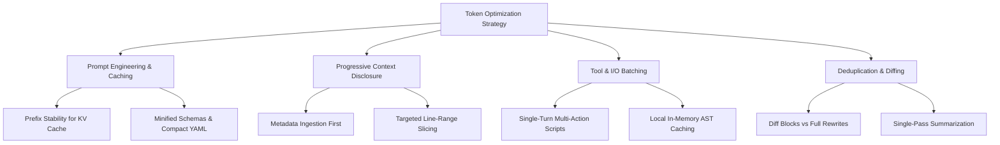

# Token Usage Optimization Architecture & Standards

A systematic blueprint for minimizing LLM token consumption, slashing API latency, and driving down inference costs while preserving 100% technical correctness and developer experience.

---

## 1. Core Principles of Token Efficiency

1. **Progressive Disclosure**: Never dump full documents or entire libraries into context unconditionally. Expose lightweight identifiers and high-level summaries first, loading complete code/instructions only upon explicit relevance matching.
2. **Prefix Stability for Prompt Caching**: Ensure static instructions, tool definitions, and system prompts remain at the top of the prompt payload with deterministic ordering. Dynamic, per-turn contents must be appended at the end to maximize KV cache hit ratios (>90% savings).
3. **Structured Slicing over Full Reads**: Always view files using narrow line ranges (`StartLine`/`EndLine`) or AST symbol extraction rather than multi-thousand line full file dumps.
4. **Differential Modifications**: Use chunked replacement tools (`replace_file_content`) over whole-file re-generation to reduce output token generation by 80–95%.

---

## 2. Quantitative FinOps & Cost Reductions

| Strategy | Token Reduction | Latency Impact | Cost Reduction |
| :--- | :--- | :--- | :--- |
| **Prompt KV Caching** | Up to 90% input token billing discount | 60–80% faster TTFT (Time to First Token) | 80–90% |
| **Progressive Disclosure** | 70–85% reduction in context window footprint | 50% lower processing latency | 70% |
| **Line-Range Slicing & AST indexing** | 60–80% fewer tokens ingested per code query | 40% faster tool execution | 65% |
| **Contiguous Diff Replacement** | 80–95% output token generation savings | 75% faster code editing rounds | 85% |
| **Tool Output Pruning & Batching** | 50–70% fewer round trips and redundant logs | 60% lower conversational roundtrip delay | 50% |

---

## 3. High-Impact Prompt Engineering Tactics

### A. Compact Structural Formatting
- Replace verbose conversational explanations with dense, bulleted action items or minified JSON/YAML.
- Strip markdown noise, repetitive disclaimers, and boilerplate introductions.

### B. Output Constrained Generation
- Direct LLMs to emit strict, machine-parsable outputs when querying for decisions or code edits:
  - *Anti-pattern*: "Here is the explanation... (500 tokens) ... and here is the file: (2000 tokens)"
  - *Optimized*: "Direct diff patch only: (150 tokens)"

### C. Context Compression & Pruning
- Strip whitespace, comments from minified third-party definitions, and git commit noise when parsing histories.
- Use AST-aware tree pruning to omit function bodies when only interface signatures are required.
